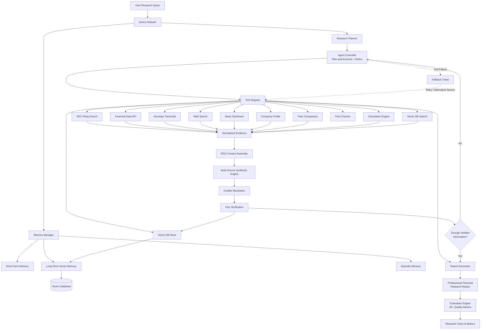

# ARA-1 System Architecture

```mermaid
flowchart TD

    U[User Research Query] --> QA[Query Analyzer]

    QA --> MM[Memory Manager]
    QA --> RP[Research Planner]

    MM --> STM[Short-Term Memory]
    MM --> LTM[Long-Term Vector Memory]
    MM --> EM[Episodic Memory]

    LTM --> VDB[(Vector Database)]

    RP --> AC[Agent Controller<br/>Plan-and-Execute + ReAct]

    AC --> TR[Tool Registry]

    TR --> SEC[SEC Filing Search]
    TR --> FD[Financial Data API]
    TR --> ET[Earnings Transcript]
    TR --> WS[Web Search]
    TR --> NS[News Sentiment]
    TR --> CP[Company Profile]
    TR --> PC[Peer Comparison]
    TR --> CE[Calculation Engine]
    TR --> VS[Vector DB Search]
    TR --> VST[Vector DB Store]
    TR --> FC[Fact Checker]
    TR --> RG[Report Generator]

    SEC --> EV[Normalized Evidence]
    FD --> EV
    ET --> EV
    WS --> EV
    NS --> EV
    CP --> EV
    PC --> EV
    CE --> EV
    VS --> EV

    EV --> RAG[RAG Context Assembly]

    RAG --> SYN[Multi-Source Synthesis Engine]

    SYN --> CR[Conflict Resolution]

    CR --> FV[Fact Verification]

    FV --> CHECK{Enough Verified<br/>Information?}

    CHECK -->|No| AC
    CHECK -->|Yes| RG

    RG --> REPORT[Professional Financial<br/>Research Report]

    REPORT --> EVAL[Evaluation Engine<br/>20+ Quality Metrics]

    EVAL --> LOG[Research Trace & Metrics]

    FV --> VST
    VST --> LTM

    AC -. Tool Failure .-> FB[Fallback Chain]
    FB -. Retry / Alternative Source .-> TR
```